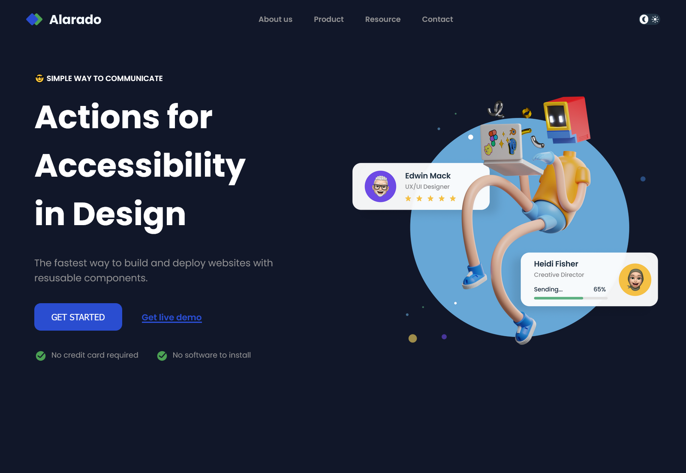

# Simple Homepage

This is a small project I made to train with HTML, CSS, Flexbox and JavaScript.

## Table of Content

- [Overview](#overview)
  - [Description](#description)
  - [Screenshot](#screenshot)
  - [Links](#links)
- [My process](#my-process)
  - [Built with](#built-with)
  - [What I learned](#what-i-learned)
  - [Continued Development](#continued-development)
  - [Useful Resources](#useful-resources)
- [Author](#author)
- [Acknowledgments](#acknowledgments)

## Overview

### Description

I present to you a small project I made. The main objective was to work with HTML, CSS, Flexbox and JavaScript to perfect my knowledge with those technologies.
It consist of a simple homepage containing a header with an interactive navbar for small screen, a button to change the theme of the webpage between light and dark, and a main section.
This project works on all device, from smartphone to desktop computer !

### Screenshot



### Links

- [Live Site](https://sephydev.github.io/simple-homepage-js/)

## My process

### Built with

- Semantic HTML5
- CSS
- Flexbox
- JavaScript Vanilla

### What I learned

Thanks to this project, I've practiced some semantic HTML, CSS, Flexbox and vanilla JavaScript. The following snippets are some examples of the knowledges I used.

- Semantic HTML5 (`<nav>`):

```html
<nav id="navbar" class="hide">
  <button id="close-nav" class="button-nav">
    <i class="fa-solid fa-x"></i>
  </button>
  <ul>
    <li><a href="#" class="grey-color">About us</a></li>
    <li><a href="#" class="grey-color">Product</a></li>
    <li><a href="#" class="grey-color">Resource</a></li>
    <li><a href="#" class="grey-color">Contact</a></li>
  </ul>
  <button class="theme-btn flex" id="theme-btn">
    
    
  </button>
</nav>
```

- CSS (`nav`):

```css
nav {
  position: absolute;
  right: 0;
  top: 0;
  padding: 1.5rem;
  text-align: right;
  height: 200vh;
}
```

- Flexbox (`.last`):

```css
.last {
  align-items: center;
  margin-top: 1rem;
  flex-wrap: wrap;
}
```

- JavaScript (`openNav.addEventListener()`):

```javascript
openNav.addEventListener("click", function (e) {
  const navbar = document.getElementById("navbar");

  navbar.classList.remove("hide");
});
```

### Continued Development

Seeing how Javascript can make a webpage more interesting and how Flexbox simplify webpage organization, I will continue to master those technologie.
I will do that by using those on other project, notably to make responsive and interactive website.

### Useful Resources

- [Guide to Flexbox (CSS Trick)](https://css-tricks.com/snippets/css/a-guide-to-flexbox/)
- [Guide to JavaScript (W3school)](https://www.w3schools.com/js/default.asp)

## Author

- Website : Sephydev

## Acknowledgment

Thanks to my friends and my family for supporting me while I journey in the land of Web Development, and during the making of this project !
